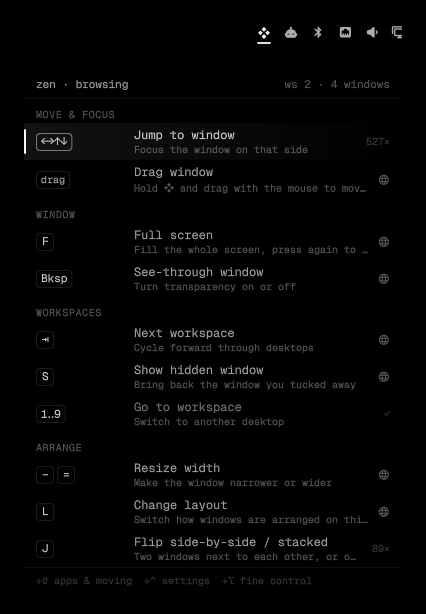

# Super Hints

Hold ❖ Super and a small panel drops from the top bar with the shortcuts you're
most likely to want right now. It learns from what you actually use, adapts to
the app you're in, and fades out shortcuts you already know so new ones can surface.



- **Context-aware.** In a terminal it leans toward tiling and moving windows; in a
  browser, full screen and passwords; on an empty workspace, launching apps. With one
  window open, tiling suggestions step aside.
- **Learns what you know.** Shortcuts you fire before the panel appears count as
  learned and drift down the list.
- **Knows what comes next.** Open an app and it suggests moving or splitting it; flip a
  split and it suggests resizing.
- **Plain language.** "Flip side-by-side / stacked" instead of "togglesplit", with a
  one-line explanation for every shortcut.
- **Adapts as you press.** Add ⇧, ⌃ or ⌥ and the list narrows to match.
- **Themed.** Uses your Omarchy theme's colors, so every theme just works.
- **Fast.** Ranking takes well under a millisecond; quick combos never trigger the panel.

Click ❖ in the bar to browse every shortcut, grouped by Move & focus, Arrange,
Window, Tabs, Workspaces, Apps, Menus and System. Right-click for settings.

Requires Omarchy with the Quickshell-based `omarchy-shell` (Quattro) and Hyprland's
Lua config. No other dependencies.

## Install

```bash
omarchy plugin add https://github.com/GlacierHubAB/omarchy-super-hints --enable
```

That adds ❖ to the right side of your bar. To get hints **while holding Super**,
also install the Hyprland bridge (asks first, backs up your config):

```bash
~/.config/omarchy/plugins/io.github.glacierhubab.super-hints/bridge.sh install
```

The bridge adds one `pcall(dofile, …)` line to `~/.config/hypr/hyprland.lua`. It
only reports when Super is held and which **Super** bindings fire. It never sees
ordinary typing. Without it, click-to-browse still works.

## Update

```bash
omarchy plugin update io.github.glacierhubab.super-hints
```

The bridge loads from the plugin folder, so updates apply to it too.

## Remove

```bash
~/.config/omarchy/plugins/io.github.glacierhubab.super-hints/bridge.sh uninstall
omarchy plugin remove io.github.glacierhubab.super-hints
rm -f ~/.config/omarchy/super-hints.jsonc
rm -rf ~/.local/state/omarchy/super-hints
```

## Settings

Right-click ❖ (or click ⚙ in the browse panel) to open
`~/.config/omarchy/super-hints.jsonc`. It's created with commented defaults and
reloads on save:

| Setting | What it does |
| --- | --- |
| `delay` | ms to hold ❖ before hints appear (default 160) |
| `rows` | suggestions shown while holding ❖ |
| `descriptions` | `"all"`, `"top"` or `"off"` |
| `groupByCategory` | group under headings |
| `weights` | balance of frequency / context / sequence |
| `learned` | how fast presses count as learned, how strongly they sink, or hide them |
| `categories` | heading order; leave one out to hide it |
| `pin` / `exclude` | always / never show a shortcut |
| `labels` | rename any shortcut in your own words |
| `apps` | per-app nudges by window class, e.g. `{ "zen": { "pass": 0.2 } }` |

Usage stats live in `~/.local/state/omarchy/super-hints/stats.json`.

## How ranking works

```
score = (frequency·w₁ + context·w₂ + sequence·w₃) × (1 − strength·learned)
```

Frequency mixes overall and per-context use. Context comes from the focused
window's class and title (terminal, vim, AI agent, browser, editor, notes) and how
many windows share the workspace. Sequence is a short boost for what usually
follows your last action. See [`DESIGN.md`](DESIGN.md) for details, and
[`mockup/index.html`](mockup/index.html) for an interactive browser mockup.

## IPC

```bash
omarchy-shell super-hints open | close | toggle | settings
omarchy-shell super-hints state           # JSON snapshot for debugging
omarchy-shell super-hints hold "super"    # simulate holding Super
omarchy-shell super-hints release
```

## Develop

```bash
node test/ranker.test.js     # ranking engine tests
./dev-install.sh             # copy this checkout into the plugins folder
omarchy restart shell        # after Ranker.js changes (QML caches JS libraries)
```

## License

MIT
